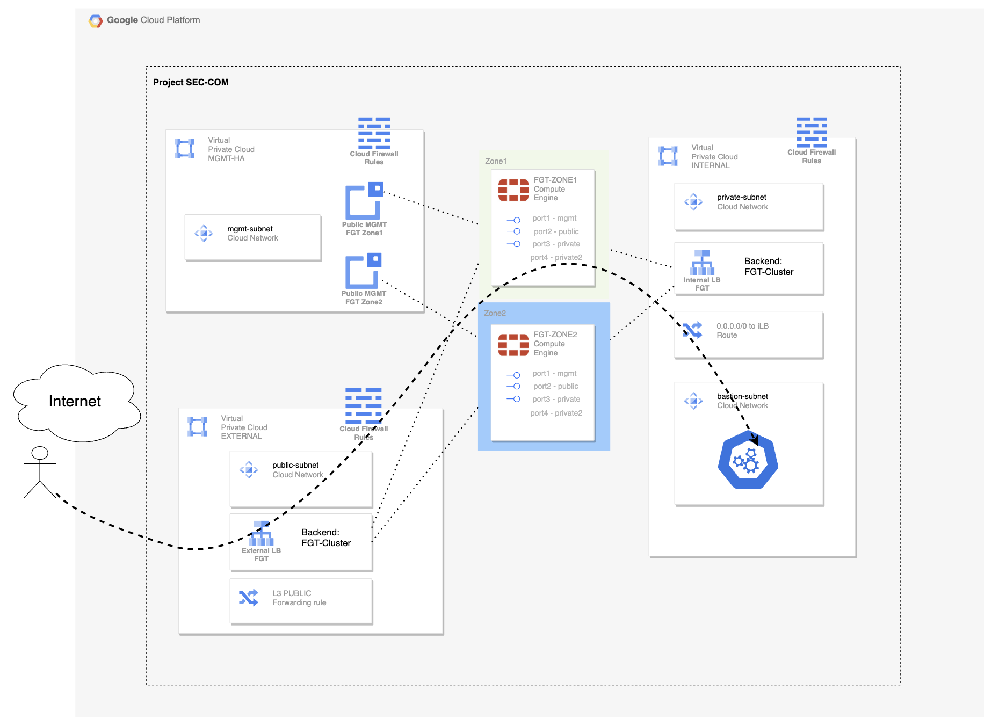

# Despligue de cluster de FortiGates en HA

Este repositorio despliega una arquitectura en Azure con las VPCs necesarias para desplegar un cluster de FortiGates y una instancia virtual de kubernetes con dos aplicaciones desplegadas para testing.

Esta basado en el módulo de [GCP Terraform Registry](https://registry.terraform.io/modules/jmvigueras/ftnt-gcp-modules/gcp/latest/examples/basic_fgt-ha-xlb)


## Deployment Overview

- Tres VPC con las subnets necesarias: Management y HA (VPC 1), Public (VPC 2), Private y Bastion (VPC 3).
- Fortigate cluster: 2 instancias de 3 interfaces, con un interfaz de Management con una IP pública asociada para gestión. Un interfaz público para backend del balanceador externo, donde está definida un frontal público para servicios. Los interfaces internos hacen de backend del balanceador interno, recibiendo el tráfico desde los servidores internos en GCP. 
- Una instancia Linux con un entorno de Kubernetes con 2 aplicaciones desplegadas para testing: DVWA y API Swagger. 

## Diagrama de arquitectura



## Código Terraform para despligue fuera de CloudLab Portal

```hcl

# ----------------------------------------------------------------------------------------
# Variables
# ----------------------------------------------------------------------------------------
variable "prefix" {
  description = "Prefix to configured items in Azure"
  type        = string
  default     = "fgt-ha-xlb"
}

variable "custom_vars" {
  description = "Custom variables"
  type = object({
    region         = optional(string, "spaincentral")
    fgt_version    = optional(string, "7.4.6")
    license_type   = optional(string, "payg")
    fgt_size       = optional(string, "Standard_F4s")
    fgt_vnet_cidr  = optional(string, "172.10.0.0/23")
    admin_username = optional(string, "azureadmin")
    k8s_size       = optional(string, "Standard_B2ls_v2")
    k8s_version    = optional(string, "1.31")
    tags           = optional(map(string), { "Deploy" = "CloudLab Azure", "Project" = "CloudLab" })
  })
  default = {}
}

# ----------------------------------------------------------------------------------------
# Module to deploy de FortiGate cluster items
# - FortiGate VNET, Subnet, routes, NSG ...
# - FortiGate HA pair VM
# ----------------------------------------------------------------------------------------
module "fgt-ha-xlb" {
  source  = "jmvigueras/ftnt-azure-modules/azure//examples/basic_fgt-ha-xlb"
  version = "0.0.8"

  prefix   = var.prefix
  location = var.custom_vars["region"]

  admin_username = var.custom_vars["admin_username"]

  license_type = var.custom_vars["license_type"]
  fgt_size     = var.custom_vars["fgt_size"]
  fgt_version  = var.custom_vars["fgt_version"]

  fgt_vnet_cidr = var.custom_vars["fgt_vnet_cidr"]

  tags = var.custom_vars["tags"]
}

```

### Requirements
* [Terraform](https://learn.hashicorp.com/terraform/getting-started/install.html) >= 1.6.0
* Check particulars requiriments for each deployment (Azure) 


## Soporte
Este es un repositorio personal de despliegues y testeo de soluciones Fortinet en Cloud. No tiene ningún tipo de soporte y debe usarse bajo tu propia responsabilidad. Los proveedores Cloud pueden añadir cargos por estos despliegues, por lo que debes tenerlo en cuenta antes de continuar.