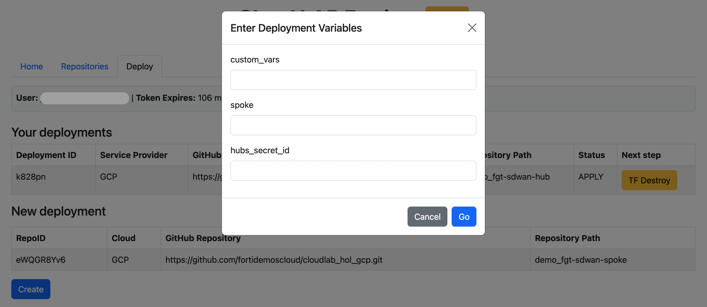
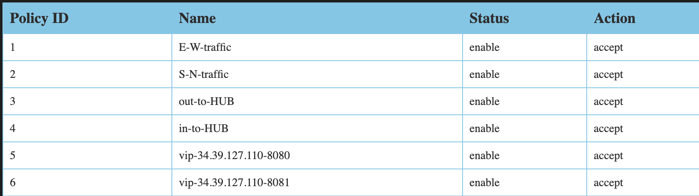

# GitOps demo de entorno SDWAN HUB and SPOKE en cloud

Esta demo consiste en un despliegue mediante Infraestructura como Código (IaC), donde desplegaremos un HUB principial de SDWAN, un SPOKE que conectará de manera automática al HUB. Además se configurán nuevas políticas en los Firewalls mediante Terraform, siguiendo una filosfia GitOps.

El entorno de despliegue será una plataforma de ingeniería donde se han dado de alta los diferentes repositorios.

## Day 0 - Despliegue de infraestructura

### Despliegue de HUB

1. Seleccionaremos el repositorio correspondiente al HUB:


2. Le damos a crear para crear el despliegue en la plataforma:


3. Las variables que podemos dar a modo de ejemplo:


Las variables esperadas tienen formato JSON. 

- custom_vars:

```json
{
    "fgt_version": "7.4.9",
    "fgt_vpc_cidr": "10.0.0.0/23",
    "license_type": "payg"
}
```

- hub:

```json
[
    {
        "id": "HUB",
        "bgp-asn_hub": "65000",
        "bgp-asn_spoke": "65000",
        "vpn_cidr": "172.16.10.0/24",
        "cidr": "10.0.0.0/8"
    }
]
```

> **Nota:** Las variables necesarias para desplegar en el hiperescalar (GCP) están almacenadas de forma centralizada en la plataforma.

4. Comenzar el proceso de despliegue.

- Init


- Apply


- Despliegue completo


5. Acceso al HUB

Una vez completado el proceso de despliegue, el estatus del despliegue aparecerá como APPLY, podremos ir a la pestaña Home para obtener los detalles.

Buscaremos nuestro despliegue y pulsaremos en **Terraform outputs** para ver los datos de acceso al HUB y el ID de los secretos generados con la información para acceder a la VPN. 


### Despliegue de SPOKE

1. Seleccionaremos el repositorio correspondiente al SPOKE:


2. Le damos al boton de **Create** para crear el despliegue en la plataforma.

3. Las variables que podemos dar a modo de ejemplo:



- custom_vars:

```json
{
    "fgt_version": "7.4.9",
    "license_type": "payg",
    "spoke_vpc_cidr": "192.168.10.0/23"
}
```

- spoke:

```json
{
    "id": "spoke1",
    "cidr": "192.168.1.0/23"
}
```

- hubs_secret_id

```
xxxxx-k828pn-hubs
```

> **Nota:** Las variables necesarias para desplegar en el hiperescalar (GCP) están almacenadas de forma centralizada en la plataforma.

4. Comenzar el proceso de despliegue.

(Seguiremos los mismos pasos que el despliegues anteriores)


5. Datos de acceso al SPOKE

Buscaremos nuestro despliegue en la pestaña **Home** y pulsaremos en **Terraform outputs** para ver los datos de acceso al SPOKE y el ID de los secretos generados con la información para acceder al FortiGate y la instancia de Kubernetes desplegada.


- Acceso a FortiGate
- Acceso al cluster de Kubernetes

## Day N - Despliegue de aplicaciones

### Publicación de aplicaciones

En este punto vamos a usar Terraform para configurar reglas de públicación en nuestro FortiGate. Los FortiGates se han desplegado con una API Key preconfigurada para poder usarla en el código Terraform con el provider de FortiOS. 

```bash
provider "fortios" {
  hostname = local.fgt_merged.api_host
  token    = local.fgt_merged.api_key
  insecure = "true"
}
```
Al igual que hemos hecho para el HUB y el SPOKE, vamos a desplegar un stack de Terraform para realizar la configuación de nuestro FortiGate siguiendo una filosofia GitOps. 

Para esto se ha preparado un repositorio, donde mediante variables JSON, vamos a poder configurar nuestros equipos. En este caso, en el SPOKE, donde se ha desplegado un nodo Kubernetes con una aplicación desplegada que queremos publicar a través del FortiGate. 

1. Seleccionamos el repositorio de Terraform para FortiGate.


2. Le damos al boton de **Create** para crear el despliegue en la plataforma.

3. Las variables que podemos dar a modo de ejemplo:


- fgt_secret_id:

```
xxxxxx-2h1gqy-fgt
```

- vips:

```json
{
    "vip-ssh": { "mappedip": "192.168.10.2", "extport": "2222", "mappedport": "22"},
    "vip-app": { "mappedip": "192.168.10.2", "extport": "80", "mappedport": "31000"}
}
```

4. Comenzar el proceso de despliegue.

(Seguiremos los mismos pasos que el despliegues anteriores, hasta que el estado del despliegue sea APPLY)


5. Comprobación de creación de políticas. 

Para confirmar que se han generado de manera correcta las políticas, tenemos diferentes maneras:

- Postman o curl:

```bash
curl --location 'https://35.197.251.239:8443/api/v2/cmdb/firewall/policy' \
--header 'Accept: application/json' \
--header 'Authorization: ••••••'
```

Con Postman vistualization tool



- Consola o GUI


- FortiManager